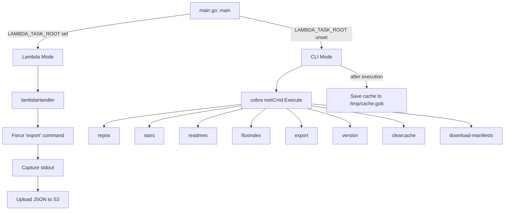
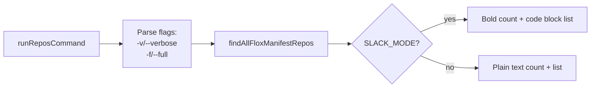
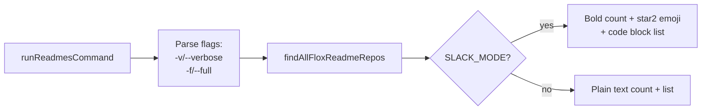
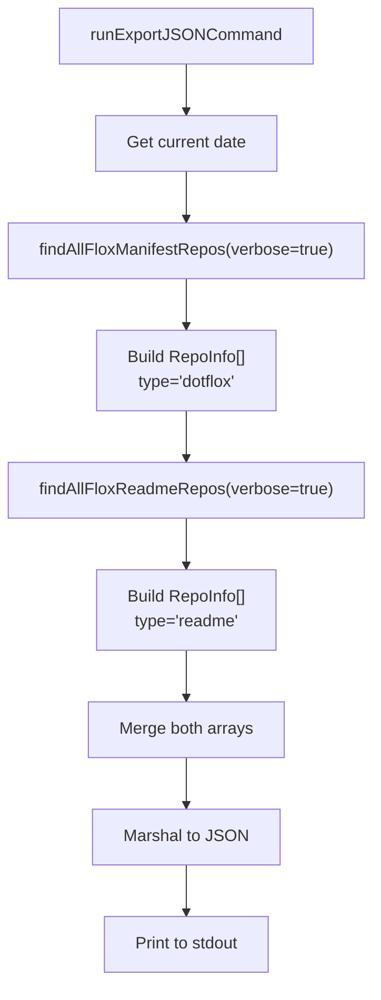
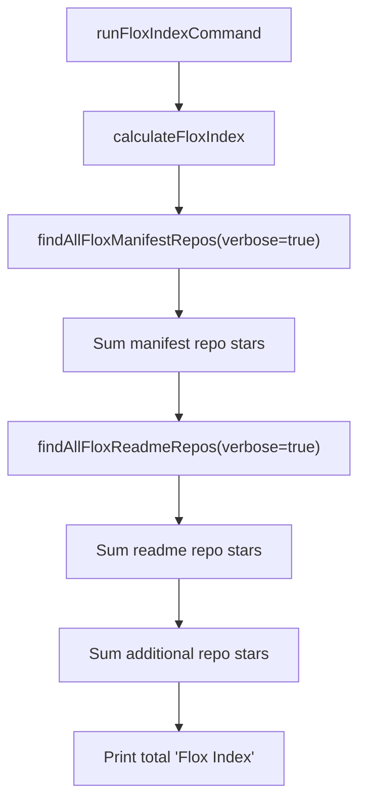
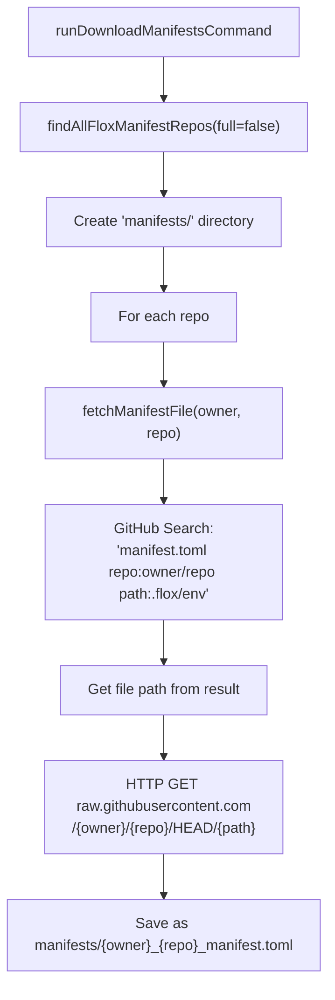
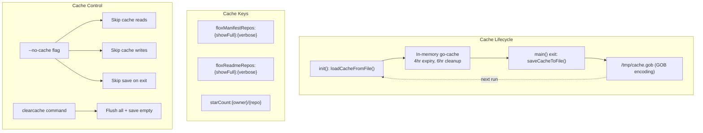
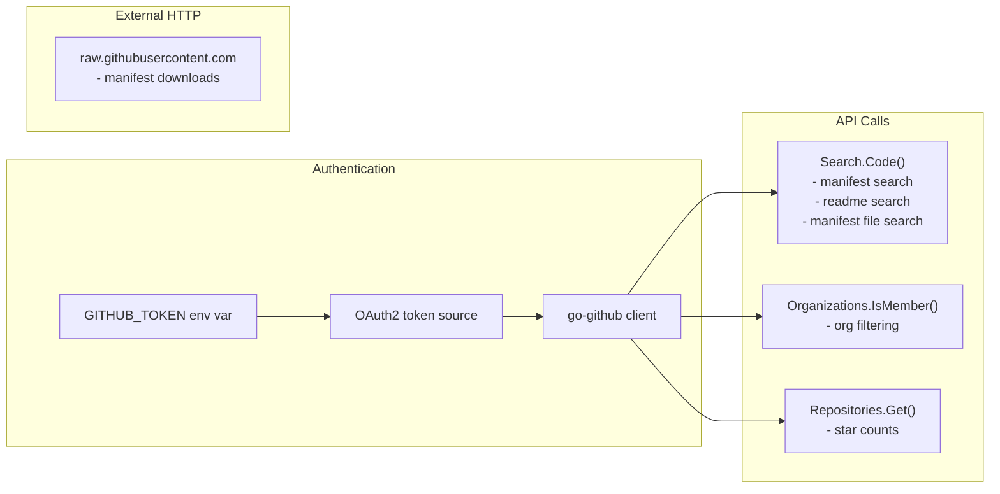
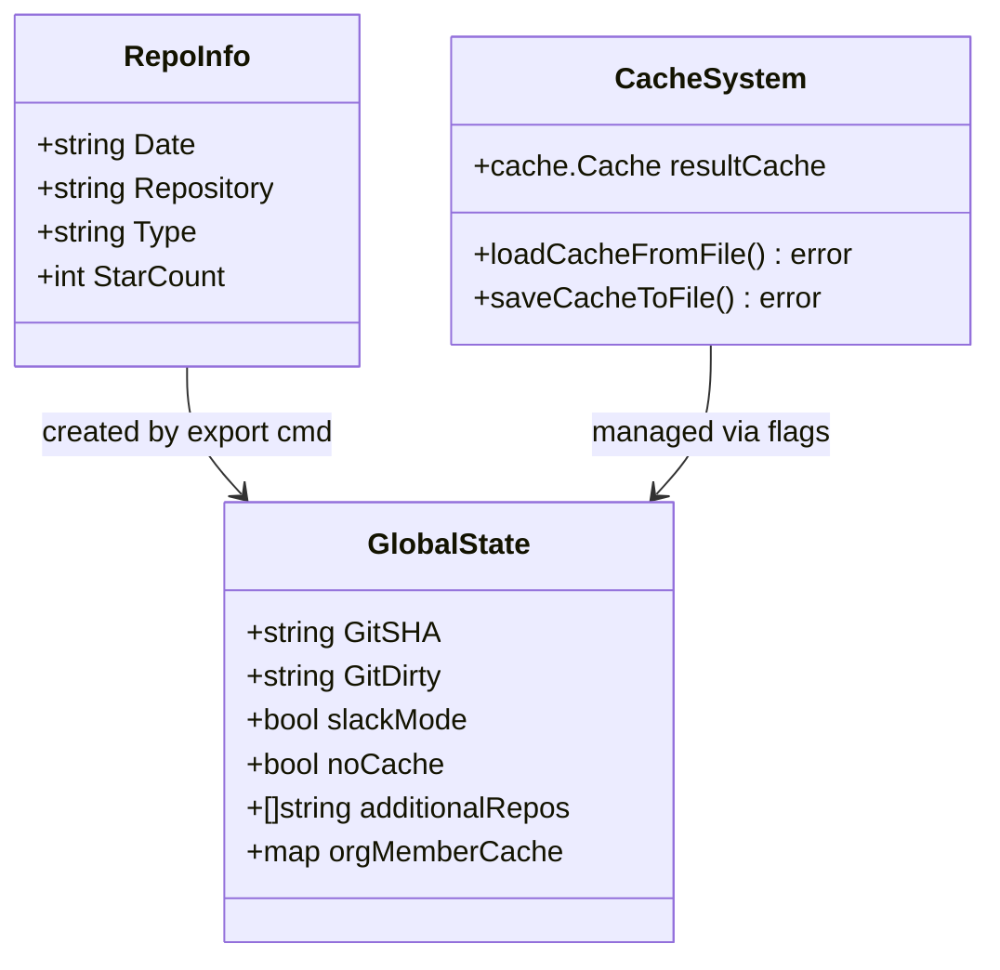
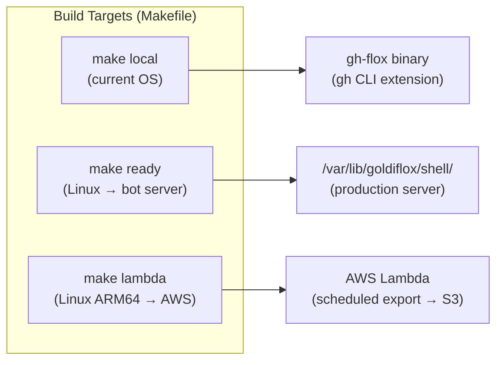

# gh-flox

Query github for flox related items.

# Usage

`gh-flox stars` - Number of :star: found on flox/flox on GitHub

`gh-flox repos -v` - List the repositories containing a `.flox` directory.

`gh-flox repos -f` - Count number of repos with a `.flox` including those owned by flox and employees

`gh-flox repos -f -v` - List the repos with a `.flox` including those owned by flox and employees

`gh-flox readmes` - Count number of repos with `flox install` string in their README

`gh-flox readmes -v` - List repos that have a README with `flox install` string in them

`gh-flox readmes -f` - Count repos with README with `flox install` including those owned by flox and employees

`gh-flox readmes -f -v` - List repos that have a README with `flox install` string in them including those owned by flox and employees

`gh-flox clearcache` - clear out the local cache

`gh-flox version` - get version of `gh-flox`

`gh-flox floxindex` - get the sum of all stars for repos scoped with `readmes` and `repos` subcommands.

`gh-flox export` - Export to JSON

# Configuration

To run with slack formatting, set `SLACK_MODE=1`. Otherwise, plain text is assumed.


  * `GITHUB_TOKEN` - required to query GitHub API
  * `S3_BUCKET_NAME` - optional, only needed when running as a lambda
  * `S3_OBJECT_KEY` - optional, only needed when running as a lambda
  * `AWS_REGION` - optional, only needed when running as a lambda

## Hand edits

Sometimes, a repository has installations instruction for flox, but not in the
primary README. In this case, you can add the slug `owner/repo` to the
`additional_repos.json` file and this will be picked up by the `readmes` sub
command. This is only read at __build time__, so you need to rebuild the
project if that file changes. This is to assist in running it as a lambda
function.

# Development

`flox activate`

`make`

# Deployment

`make ready` ships to the hubot server if you're all set up.

# Code Flow

## High-Level Architecture



## Command Execution Flow

```mermaid
flowchart TD
    subgraph init["init()"]
        I1[Register all subcommands with cobra] --> I2[Load cache from /tmp/cache.gob]
        I2 --> I3[Configure Viper: SLACK_MODE]
        I3 --> I4["Parse additional_repos.json (go:embed)"]
    end

    subgraph main["main()"]
        M1{LAMBDA_TASK_ROOT?} -->|yes| LAMBDA
        M1 -->|no| CLI
    end

    init --> main

    subgraph LAMBDA["Lambda Path"]
        L1[Set os.Args to 'export'] --> L2[Redirect stdout to pipe]
        L2 --> L3[Execute rootCmd]
        L3 --> L4[Read captured output]
        L4 --> L5[Connect to S3]
        L5 --> L6["Upload as {date}.json"]
    end

    subgraph CLI["CLI Path"]
        C1[rootCmd.Execute] --> C2{Which subcommand?}
        C2 --> CMD
    end

    subgraph CMD["Command Handlers"]
        R1[runReposCommand]
        R2[runStarsCommand]
        R3[runReadmesCommand]
        R4[runFloxIndexCommand]
        R5[runExportJSONCommand]
        R6[runVersionCommand]
        R7[runClearCacheCommand]
        R8[runDownloadManifestsCommand]
    end

    CLI --> SAVE[saveCacheToFile]
```

## Core Search Functions

```mermaid
flowchart TD
    subgraph findManifest["findAllFloxManifestRepos(showFull, verbose)"]
        FM1{Cache hit?} -->|yes| FM_RET[Return cached results]
        FM1 -->|no| FM2["GitHub Search:\n'.flox/env/manifest.toml in:path'"]
        FM2 --> FM3[Paginate results]
        FM3 --> FM4[Deduplicate repos via map]
        FM4 --> FM5{showFull?}
        FM5 -->|no| FM6["Filter: isOrgMember(owner, 'flox')\nExclude 'flox' & 'flox-examples' orgs"]
        FM5 -->|yes| FM7[Keep all repos]
        FM6 --> FM8{verbose?}
        FM7 --> FM8
        FM8 -->|yes| FM9[Fetch star counts per repo]
        FM8 -->|no| FM10[Skip star counts]
        FM9 --> FM11[Sort alphabetically]
        FM10 --> FM11
        FM11 --> FM12[Cache results]
        FM12 --> FM_RET
    end

    subgraph findReadme["findAllFloxReadmeRepos(showFull, verbose)"]
        FR1{Cache hit?} -->|yes| FR_RET[Return cached results]
        FR1 -->|no| FR2["GitHub Search:\n'\"flox install\" in:file filename:README'"]
        FR2 --> FR3[Paginate results]
        FR3 --> FR4[Deduplicate repos via map]
        FR4 --> FR5{showFull?}
        FR5 -->|no| FR6["Filter: isOrgMember(owner, 'flox')\nExclude 'flox' & 'flox-examples' orgs"]
        FR5 -->|yes| FR7[Keep all repos]
        FR6 --> FR8[Merge additional_repos.json entries]
        FR7 --> FR8
        FR8 --> FR9{verbose?}
        FR9 -->|yes| FR10[Fetch star counts per repo]
        FR9 -->|no| FR11[Skip star counts]
        FR10 --> FR12[Sort alphabetically]
        FR11 --> FR12
        FR12 --> FR13[Cache results]
        FR13 --> FR_RET
    end
```

## Command Detail: repos



## Command Detail: readmes



## Command Detail: export (JSON)



## Command Detail: floxindex



## Command Detail: download-manifests



## Cache System



## GitHub API Interactions



## Data Structures



## Deployment Modes



# License
MIT
